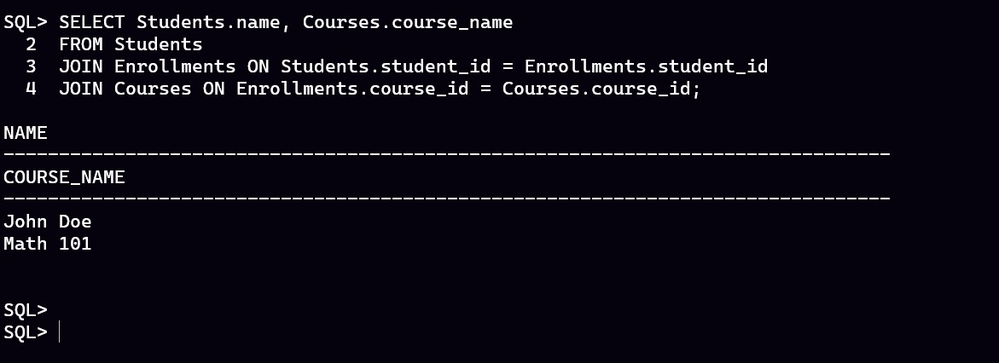
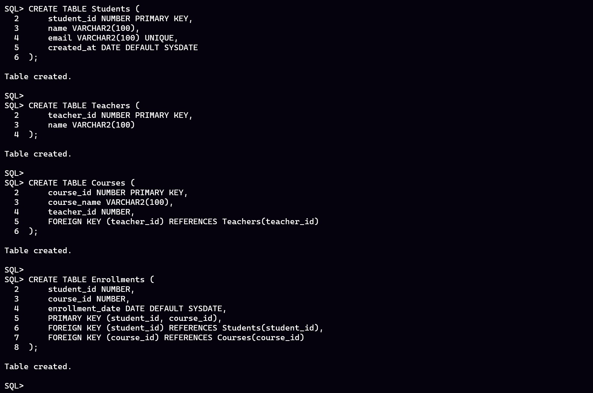
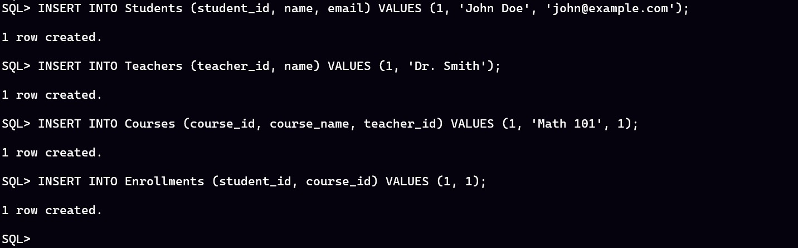

# PL/SQL Assignment

### Problem Statement
This database system is designed for managing student course enrollments in an educational institution. The system keeps track of students, teachers, courses, and student enrollments. It allows administrators to manage student records, assign teachers to courses, and track enrollments efficiently.

### Screenshots

